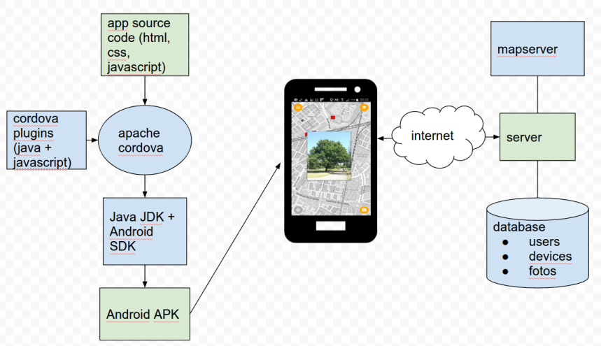

# Phenology App
Android app and corresponding server to track and view the changing appearance, _phenology_, of vegetation, trees in particular. Take a picture of a tree, later return to the picture location using the built in map, take a new picture of the same tree overlaid on top of the previous picture and view the resulting animation.

Install app:
-------
>download and install [the apk](https://phenology.geodan.nl/phenology/apk/android-debug5.apk) to your android device

Build app from source
-------
#### Prerequisites
* Apache Cordova (requires Android SDK wich requires Java SDK)
* git
* bower

```
git clone https://github.com/anneb/phenology.git
cd phenology/www/ol3
bower install
cd ../..
cordova platform add android
cordova plugin add `cat cordovaplugins.txt`
# update www/ol3/config.js for your configuration
cordova build
```


Install server
-------
#### Prerequisites
* postgres database (version 9.5)
* postgis extension
* nodejs
* http and https reverse proxy server (haproxy, nginx, apache httpd)

create a postgres database 'locophoto', user 'geodb', password 'yourpassword'


```
git clone this_repository.git
cd photoapp/node

#create database tables
psql -h localhost -U geodb -W locophoto < database.sql

# install libraries
npm install

#start the server
node photoserver.js
```


Overview
------


Server API
------

#### /getphotos
__Request Type__: http GET

__Response__: Returns a JSON list of all public viewable photos on the server formatted as [GeoJSON featurecollection](http://geojson.org/geojson-spec.html).

Every photo has the following attributes:
* Point coordinate (longitude, latitude, WGS84), of the camera location where the photo was taken
* id: unique numeric id of the photo
* filename: the filename including extension of the photo. When the file extension is 'gif', the file an animation built from multiple photo's at the same location. The original static photo can be obtained by replacing the '.gif' extension with '.jpg'
* accuracy: a measure for the accuracy of the photo location, smaller is better
* time: date and time when the photo was added to the server
* width: width of the photo in pixels
* height: height of the photo in pixels

example: https://phenology.geodan.nl/photoserver/getphotos

#### /uploads/filename
__Request Type__: http GET

__Response__: Returns a photo or animation indicated by 'filename'. Filenames can be obtained by a request to /getphotos. If the filename extension is '.gif', the resulting image will be an animation of all photos taken at the same location. If the '.gif' extension is replaced by '.jpg', the first static photo is returned.

example: https://saturnus.geodan.nl/uploads/fd55236bc1d9f8ab13d53204fa908dd4.gif

